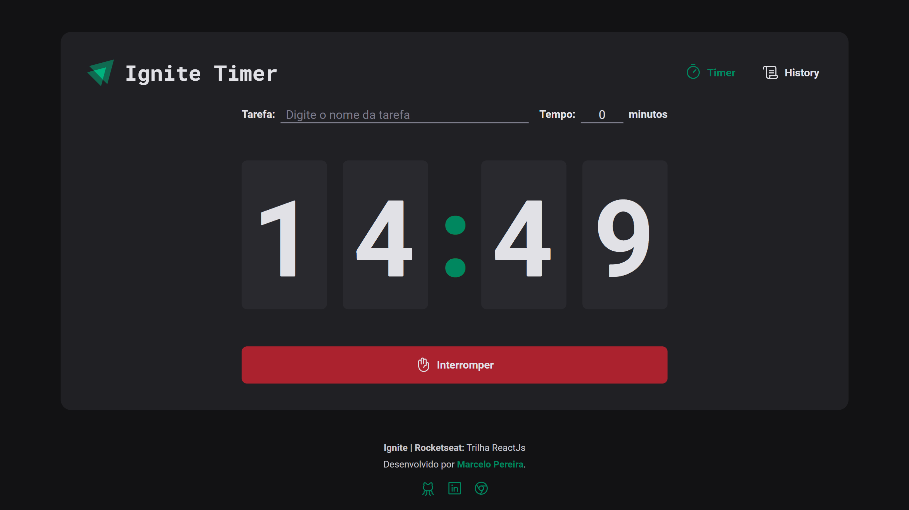

# Timer - Ignite | Rocketseat: Trilha ReactJs

## Sobre o projeto

Essa aplicação foi desenvolvida no Ignite | Rocketseat: Trilha ReactJs. Trata-se de uma aplicação web (SPA) desenvolvida com ReactJs que possibilita o usuário cadastrar uma tarefa e estipular um tempo para realizá-la (Técnica Pomodoro).

## Tecnologias

- ReactJs
- Vite
- TypeScript
- Styled-components
- Heact Hook Forms
- Zod
- Immer
- Phosphor Icons
- Vercel

## Deploy

Este projeto foi publicado na **_Vercel_**. 

[https://ignite-timer.marcelopereira.dev](https://ignite-timer.marcelopereira.dev)
